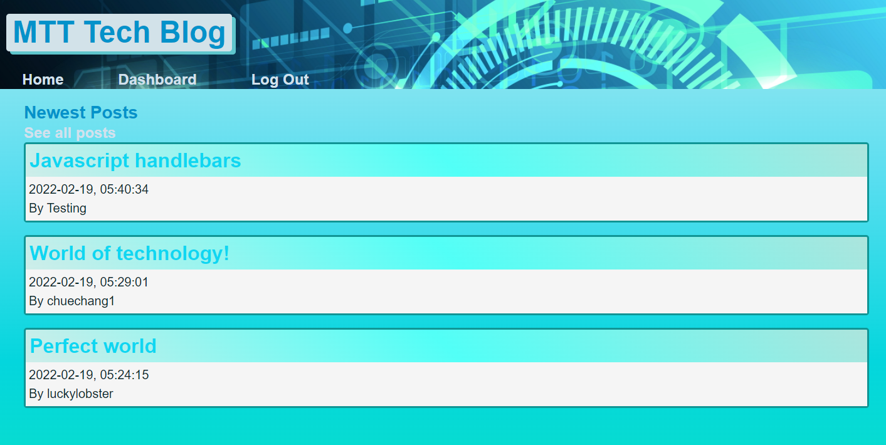

# Tech_Blog_project💎
  
[LINK TO GITHUB](https://github.com/luckylobster25/Tech-Blog)  
[LINK TO HEROKU-LIVE](https://thawing-peak-67886.herokuapp.com/)  
Here is an log-in for the Heroku. Email: test@test.com Password: 123456789 or Create your own log in.  

********************************  

## 📝 Table of Content
*[Introduction](#introduction)  
*[Installation](#installation)  
*[Usage](#usage)  
*[Contribution](#contribution)  
*[Test](#test)  
*[Question](#question)  
*[License](#license)  
## Introduction: 
This is an application which allow users to log in, log out, create post and view other user's post. The web application also track the time and date that user post.  
## 🛠️ Installation required:
Required "bcryt", "connect-session-sequelize", "dotenv", "express", "express-handlebars", "express-session", "mysql2" and "sequelize".  
## How to use this application:
It is an easy to use application with minimal usuage at the moment. User can use application through web browser. 
## Contribution:
All contributions are welcome! 
## Test
failed on displaying comments, accessing post created by user. 
## Question
If there is any questions, free feel to reach out to me through github or email.  
📧 Email: <chuechang25@gmail.com>  
📂 Github: <https://github.com/luckylobster25>  
## License
THE SOFTWARE IS PROVIDED "AS IS" AND THE AUTHOR DISCLAIMS ALL WARRANTIES WITH REGARD TO THIS SOFTWARE INCLUDING ALL IMPLIED WARRANTIES OF MERCHANTABILITY AND FITNESS. IN NO EVENT SHALL THE AUTHOR BE LIABLE FOR ANY SPECIAL, DIRECT, INDIRECT, OR CONSEQUENTIAL DAMAGES OR ANY DAMAGES WHATSOEVER RESULTING FROM LOSS OF USE, DATA OR PROFITS, WHETHER IN AN ACTION OF CONTRACT, NEGLIGENCE OR OTHER TORTIOUS ACTION, ARISING OUT OF OR IN CONNECTION WITH THE USE OR PERFORMANCE OF THIS SOFTWARE.  

